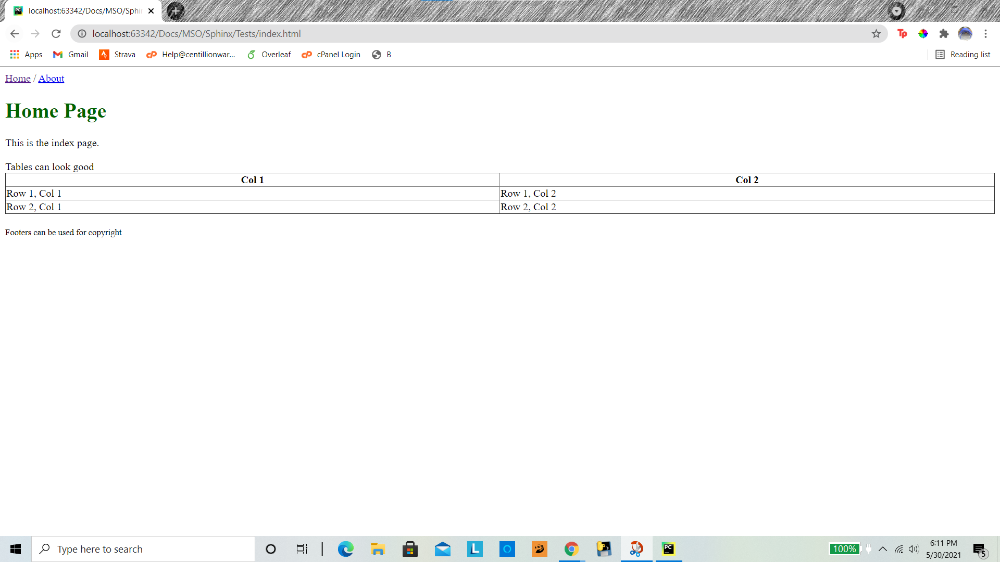
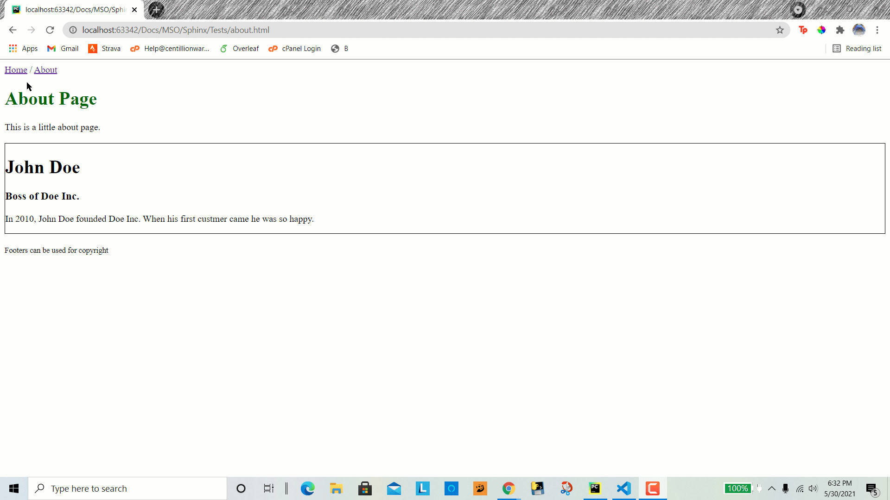

Max Script Online (MSO) Tutorial
================================

What is Max Script Online (MSO)
********************************
Max Script Online (MSO) is a modern easy to use tool for HTML. It is a
JavaScript Library that can make coding with more than one HTML page easy.
You only need to code your navigation once for more than one HTML page.

Step 1: Code the Template
**************************

Coding your template is just like coding a regular HTML page. I will put
the following code into *template.html*

.. code-block:: html

    <!DOCTYPE html>
    <html lang="en">
        <body>
            <!-- This is a navigation. We will create these pages later -->
            <a href="index.html">Home</a> / <a href="about.html">About</a>
             
            <h1 style="color: darkgreen"><{Title}></h1>
            <{Body}>
             
            <small>Footers can be used for copyright</small>
        </body>

    </html>

This looks like an html page, but what about **<{Body}>** and **<{Title}>**
tag objects? This is a placeholder for where code will go later on. You
can call them whatever you want as long as it starts with **<{** and ends
with **}>**.

Step 2: Make the page
**************************

Now we have to apply the template. The basic skeleton for these pages looks
like the following. I will put the code in *index.html*

.. code-block:: html

    <!DOCTYPE html>
    
    <body onload="MsoSetup('', [])">

    </body>

Okay. What did we do? On line 2 we imported Max Script Online (MSO).
On the next line we have the body element and when it loads it
executes **MsoSetup**. The first parameter in **MsoSetup** is for the
path to your template. I will put **template.html**. Most modern browsers
do not support reading from a file that is not on the same server. The
next parameter is for all the placeholders. To add them to the parameters
they are added in the JavaScript list.

.. code-block:: html

    <!DOCTYPE html>
    
    <body onload="MsoSetup('template.html', ['Title', 'Body'])">

    </body>

All right! We added the parameters! Now we have to specify what goes into the
placeholders. You can do this by using any html tag. To mark what placeholder
it is, the id of the tag must be one of the placeholders. I will use **div**.

.. code-block:: html

    <!DOCTYPE html>
    
    <body onload="MsoSetup('template.html', ['Title', 'Body'])">
        
Home Page

        

            This is the index page.    

            Tables can look good  
            <table style="border-collapse: collapse; width: 100%;" border="1">
                <thead>
                    <th>Col 1</th>
                    <th>Col 2</th>
                </thead>

                <tbody>
                    <tr>
                        <td>Row 1, Col 1</td>
                        <td>Row 1, Col 2</td>
                    </tr>

                    <tr>
                        <td>Row 2, Col 1</td>
                        <td>Row 2, Col 2</td>
                    </tr>
                </tbody>

            </table>

        

    </body>

Okay! We have set the placeholders.

Step 3: Testing the page
**************************

To test the page, you cannot just double click on it in your files. For
safety reasons you can only run this on http:// or https://, not file://.
If you have a file on your local computer that you want to run you can use a
local server. Some Editors like
`Pycharm <https://www.jetbrains.com/pycharm/>`_
can make a local server.

The output (Click to enlarge):

Step 4: Make the About Page
****************************

You can use the template more then once. Lets make an about page to
try it. We can it about. I will put the code in *about.html*.

.. code-block:: html

    <!DOCTYPE html>
    
    <body onload="MsoSetup('template.html', ['Title', 'Body'])">
        
About Page

        

           This is a little about page.   

            

                <h1>John Doe</h1>
                <h3>Boss of Doe Inc.</h3>
                
In 2010, John Doe founded Doe Inc. When his first custmer came he was so happy.

            

        

    </body>

If we test it it should show this (Click to enlarge):

